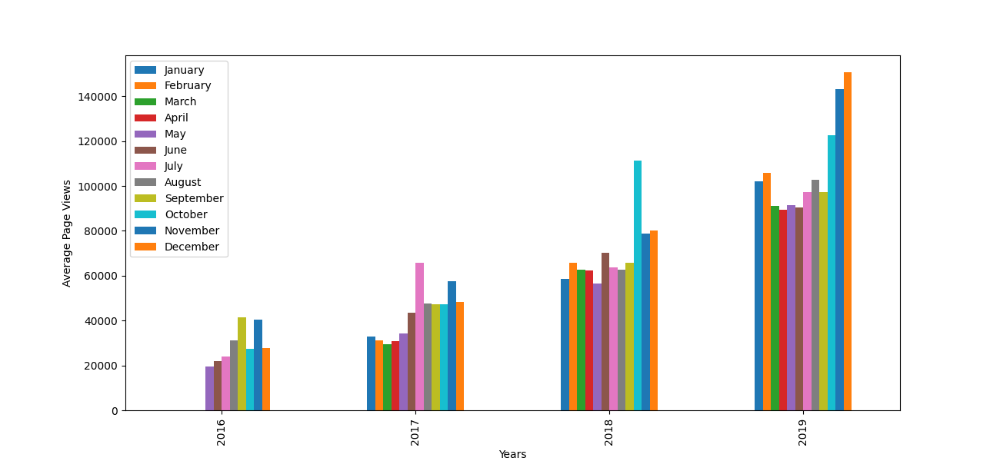

# Page View Time Series Visualizer

The objective of this project is to visualize a time series of data using a <mark style='background-color:blue'>line chart</mark>, bar chart, and box plots. We will do this by using Pandas, Matplotlib, and Seaborn to visualize a dataset containing the number of page views each day on the freeCodeCamp.org forum from 2016-05-09 to 2019-12-03. The data visualizations will aid in understanding the patterns of visits while identifying yearly and monthly growth.

# Table of Content
* [Introduction](#Intro)
* [Conditions](#Cond)
* [Impoting CSV](#CSV)
* [Cleaning Data](#Clean)
* [Line Chart](#line)
* [Bar Chart](#bar)
* [Box Plot](#box)

## Introduction <a name="Intro"></a>
We will be using the data given to us to complete the following tasks:

1. Using Pandas to import the data from "fcc-forum-pageviews.csv" and setting the index to the "date" column.
2. Cleaning the data by filtering out days when the page views were in the top 2.5% of the dataset or bottom 2.5% of the dataset.
3. Creating a <kbd>draw_line_plot</kbd> function that uses Matplotlib to draw a line chart similar to "examples/Figure_1.png". The title will be labeled as "Daily freeCodeCamp Forum Page Views 5/2016-12/2019". The label on the x-axis will be "Date" and the label on the y-axis will be "Page Views".
4. Creating a <kbd>draw_bar_plot</kbd> function that draws a bar chart similar to "examples/Figure_2.png". It will show an average daily page views for each month grouped by year. The legend will show month labels and have a title of "Months". On the chart, the label on the x axis will be "Years" and the label on the y-axis will be "Average Page Views".
5. Creating a <kbd>draw_box_plot</kbd> function that uses Seaborn to draw two adjacent box plots similar to "examples/Figure_3.png". These box plots will show how the values are distributed within a given year or month and how it compares over time. The title of the first chart should be "Year-wise Box Plot (Trend)" and the title of the second chart should be "Month-wise Box Plot (Seasonality)". Making sure the month labels on bottom start at "Jan" and the x and x-axis are labeled correctly. The boilerplate includes commands to prepare the data.


## Conditions <a name="Cond"></a>


For each chart, we will be using a copy of the data frame. Unit tests are written under [test_module.py](test_module.py).

The boilerplate also includes commands to save and return the image.

We start off by having set factors ready for us to work off of. Here we have an data from an excel spreadsheet of [page views](forum-page-views.csv) from the freeCodeCamp forum page.

We are also provided with graph examples of how our outcomes should appear for our [line chart](examples/Figure_1.png), [bar chart](examples/Figure_2.png), and [box chart](examples/Figure_3.png).

## Importing CSV <a name="CSV"></a>
Import data while making sure to parse dates. We can consider setting index column to 'date'.
We may search for the appropriete usage of pandas for importing CSV files by the following [documentation](https://pandas.pydata.org/docs/reference/api/pandas.read_csv.html). We can then see how <kbd>index_col</kbd> and <kbd>parse_dates</kbd> are the most appropeite to use for meeting our condtions.
```
df = pd.read_csv("fcc-forum-pageviews.csv",parse_dates = ["date"], index_col = "date")
```
## Cleaning Data <a name= "Clean"></a>

Setting conditions to find the top 2.5% and bottom 2.5% (97.5%) of the datasets.

```
df = df[
  (df["value"] >= df["value"].quantile(0.025)) &
  (df["value"] <= df["value"].quantile(0.975))]
```

Returned output of the spreadsheet: 


## Line Chart <a name="line"></a>

Plotting the line graph and size:

```
def draw_line_plot():
      fig, ax = plt.subplots(figsize=(10, 5))
      ax.plot(df.index, df['value'], 'r', linewidth=1)
```
Setting the labels of the graph:
      
```
      ax.set_title('Daily freeCodeCamp Forum Page Views 5/2016 - 12/2019')
      ax.set_xlabel('Date')
      ax.set_ylabel('Page views')
```
Setting the input to save and return the graph:
      
```
      fig.savefig('line_plot.png')
      return fig
```

<details>
  <summary>
      Line Plot Solution
      
 </summary>
  
    def draw_line_plot():
      fig, ax = plt.subplots(figsize=(10, 5))
      ax.plot(df.index, df['value'], 'r', linewidth=1)
      ax.set_title('Daily freeCodeCamp Forum Page Views 5/2016 - 12/2019')
      ax.set_xlabel('Date')
      ax.set_ylabel('Page views')
      fig.savefig('line_plot.png')
      return fig
        
</details>

Returns:


## Bar Chart <a name="bar"></a>

Preparing data for bar graph by sorting months and year values:
```
def draw_bar_plot():
    df["month"] = df.index.month
    df["year"] = df.index.year
    df_bar = df.groupby(["year", "month"])["value"].mean()
    df_bar = df_bar.unstack()
```
Setting up bar graph to be plot
```
    fig = df_bar.plot.bar(legend=True, figsize = (13, 6), ylabel="Average Page Views", xlabel="Years").figure
    plt.legend(['January', 'February', 'March', 'April', 'May', 'June', 'July', 'August', 'September', 'October', 'November', 'December'])
    plt.xticks(fontsize = 10)
    plt.yticks(fontsize = 10)
```
For saving graph and returning figure:
```
    fig.savefig('bar_plot.png')
    return fig
```

Pandas [documentation](https://pandas.pydata.org/docs/reference/api/pandas.DataFrame.plot.bar.html) for plotting bar chart.
plot.bar and determining the type of string under the 

Output return:




## Box Plot <a name="box"></a>

```
def draw_box_plot():
    df_box = df.copy()
    df_box.reset_index(inplace = True)
    df_box['year'] = [d.year for d in df_box.date]
    df_box['month'] = [d.strftime('%b') for d in df_box.date]
```

```
    df_box["month_num"] = df_box["date"].dt.month
    df_box = df_box.sort_values("month_num")
```

```
    fig, axes = plt.subplots(nrows=1, ncols=2, figsize=(10,5))
    axes[0] = sns.boxplot(x=df_box["year"], y=df_box["value"], ax = axes[0])
    axes[1] = sns.boxplot(x=df_box["month"], y=df_box["value"], ax = axes[1])

    axes[0].set_title("Year-wise Box Plot (Trend)")
    axes[0].set_xlabel("Year")
    axes[0].set_ylabel("Page Views")

    axes[1].set_title("Month-wise Box Plot (Seasonality)")
    axes[1].set_xlabel("Year")
    axes[1].set_ylabel("Page Views")
  

```
Output return:


